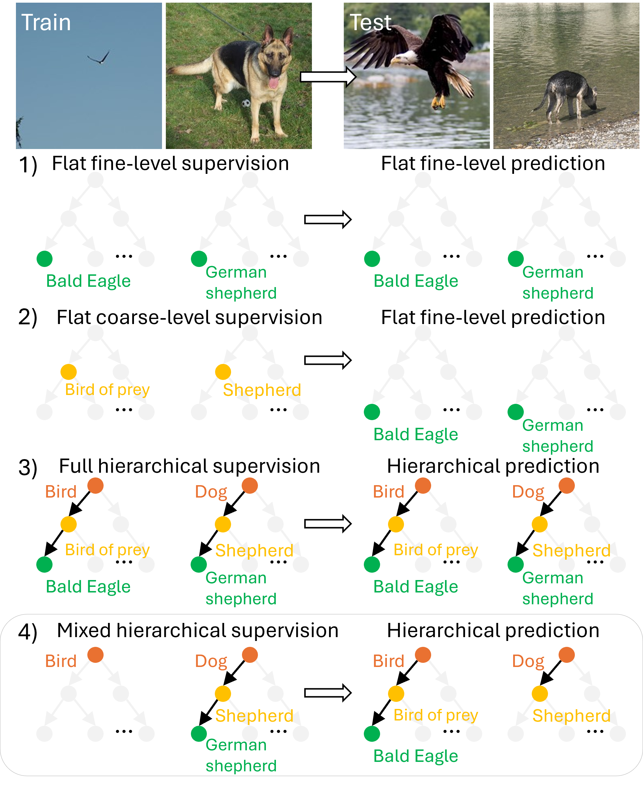

# Free-Grained Hierarchical Visual Recognition
By [Seulki Park](https://sites.google.com/view/seulkipark/home), [Zilin Wang](https://wayne2wang.github.io/), and [Stella X. Yu](https://web.eecs.umich.edu/~stellayu/)   
Official implementation of ["Free-Grained Hierarchical Visual Recognition"](https://arxiv.org/pdf/2510.14737), CVPR, 2026.


## 🔍 Overview
<table>
  <tr>
    <td width="30%">
      
    </td>
    <td width="60%">
      Real-world data rarely comes with complete hierarchical labels—some images are labeled coarsely, others finely. We propose free-grain learning, where label granularity is free to vary across samples, to handle mixed-granularity supervision and reveal that current methods fail under this setting. Our methods recover missing supervision and enable models to adaptively predict at the right level of detail.
    </td>
  </tr>
</table>

## 🗂️ Dataset
### 1) ImageNet-3L & ImageNet-F
**ImageNet-3L** is a 3-level hierarchy with aligned semantic granularity for hierarchical recognition.
**ImageNet-F** enables learning under varying label granularity, where labels may appear at different levels.
* **Hierarchy**: 20 (basic) → 127 (subordinate) → 505 (fine-grained) classes
* **Size**: 645,480 training images / 25,250 validation images

Download the [ImageNet (2012) dataset](https://www.image-net.org/download.php).

---

#### 📁 Data Structure

The `data/` directory contains:

* `imagenet-3L-id_basic_dic.json`
  → mapping from **basic-level IDs** to class names
* `imagenet-3L-id_subord_dic.json`
  → mapping from **subordinate-level IDs** to class names
* `imagenet-3L-id_finegrained_dic.json`
  → mapping from **fine-grained IDs** to class names
* `imagenet-F-train.txt`, `imagenet-F-val.txt`
  → image paths and labels

---

#### 🧾 Annotation Format

- `train.txt`: `image_path  basic  subordinate  fine-grained  given_label`  
- `val.txt`: `image_path  basic  subordinate  fine-grained`

---

#### 🔍 How to Use

* **Full supervision (ImageNet-3L)**
  → Use the first three labels:
  `basic / subordinate / fine-grained`

* **Free-grain setting (ImageNet-F)**
  → Use the last column: `given_label`

  The label granularity is determined by its value:

  * `0–19` → **basic level only**
  * `20–146` → **up to subordinate level**
  * `147+` → **fine-grained level**

---


## 🛠️ Installation
- Python: 3.10
- CUDA: 12.1
- PyTorch: 2.1.2
- DGL: 2.4.0  (For [H-CAST](https://github.com/pseulki/HCAST))
- GCC: 11.2.0 (For H-CAST, Recommended to avoid errors when running DGL)

Create a conda environment with the following command:
```
# create conda env
> conda create -n py310 python=3.10
> conda activate py310
> pip install -r requirements.txt
> pip install torch==2.1.2 torchvision==0.16.2 --index-url https://download.pytorch.org/whl/cu121


# install dgl (https://www.dgl.ai/pages/start.html)
> pip install dgl -f https://data.dgl.ai/wheels/torch-2.1/cu121/repo.html
```


## ▶️  Training
- ImageNet-pretrained [CAST](https://openreview.net/forum?id=IRcv4yFX6z)-small model can be downloaded from: [Link](https://huggingface.co/twke/CAST/blob/main/snapshots/deit/imagenet1k/cast_small/best_checkpoint.pth)

- ImageNet-pretrained [DeiT](https://arxiv.org/abs/2012.12877)-small model can be downloaded from: [Link](https://dl.fbaipublicfiles.com/deit/deit_small_patch16_224-cd65a155.pth)

- Download the captions ('imagenetF_caps.txt') from [here](https://drive.google.com/file/d/1yHve-kFpp9_7HBSV-03s0T_UGkVr8EIo/view?usp=sharing), and place them under the `captions/` directory.

```
export PYTHONPATH=deit/:$PYTHONPATH
export PYTHONPATH=deit/dataset/:$PYTHONPATH
```
---

### ImageNet-F 

#### Text-Attr (H-CAST)
We do not use ImageNet-pretrained model for ImageNet-F.

```
torchrun --nproc_per_node=4 deit/main_suppix_partial_cap.py \
  --model cast_small \
  --batch-size 256 \
  --epochs 200 \
  --num-superpixels 196 --num_workers 8 \
  --globalkl --gk_weight 0.5 \
  --data-set IMNET-F-SUPERPIXEL-CAP \
  --data-path dataset/ImageNet \
  --output_dir ./output/text_hcast \
  --texts captions/imagenetF_caps.txt --sim_loss_weight 1 \
  --distributed 

```
## 📊  Evaluation
Not that captions are not used during inference time.

```
python deit/main_suppix_partial_cap.py \
  --model cast_small \
  --batch-size 256 \
  --num-superpixels 196 --num_workers 8 \
  --data-set IMNET-F-SUPERPIXEL-CAP  \
  --data-path dataset/ImageNet \
  --output_dir ./output/text_hcast \
  --resume ./output/text_hcast/best_checkpoint.pth \
  --eval 
```


## 🔗 Results and Checkpoints

| Dataset    | Method              | FPA    | Model Checkpoint |
|------------|---------------------|--------|------------------|
| ImageNet-F | Text-Attr (H-CAST) | 63.20% | [Download](https://drive.google.com/file/d/1yHve-kFpp9_7HBSV-03s0T_UGkVr8EIo/view?usp=drive_link) |


## 🚧 Coming Soon

- [ ] Support for additional datasets  
- [ ] Support for additional methods  
- [ ] Release other pretrained checkpoints  

## 🔗 Code Base
This repository is heavily based on **[H-CAST](https://github.com/pseulki/HCAST)** and **[CHMatch](https://github.com/sailist/CHMatch)**. We sincerely appreciate the authors for making their code publicly available.


## 📢 Citation
If you find this repository helpful, please consider citing our work:
```
@article{park2025free,
  title={Free-Grained Hierarchical Visual Recognition},
  author={Park, Seulki and Wang, Zilin and Yu, Stella X},
  journal={arXiv preprint arXiv:2510.14737},
  year={2025}
}
```
Thank you for your support! 🚀
