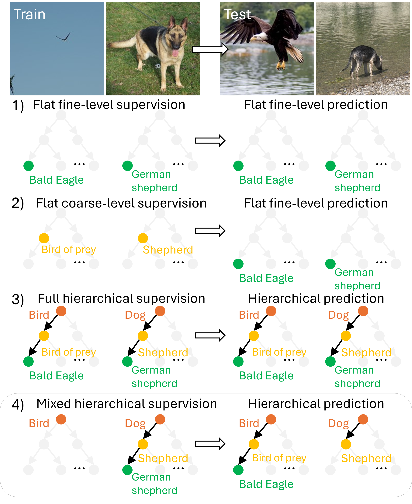

# Free-Grained Hierarchical Visual Recognition
By [Seulki Park](https://sites.google.com/view/seulkipark/home), [Zilin Wang](https://wayne2wang.github.io/), and [Stella X. Yu](https://web.eecs.umich.edu/~stellayu/)   
Official implementation of ["Free-Grained Hierarchical Visual Recognition"](https://arxiv.org/pdf/2510.14737), CVPR, 2026.


## 🔍 Overview
<table>
  <tr>
    <td width="30%">
      
    </td>
    <td width="60%">
      Real-world data rarely comes with complete hierarchical labels—some images are labeled coarsely, others finely. We propose free-grain learning, where label granularity is free to vary across samples, to handle mixed-granularity supervision and reveal that current methods fail under this setting. Our methods recover missing supervision and enable models to adaptively predict at the right level of detail.
    </td>
  </tr>
</table>

## 🗂️ Datasets

All datasets share the same 3-level structure: **basic → subordinate → fine-grained**.
Free-grain labels come in two flavors:

* **Synthesized** (`AIR-HIER`, `BIRD-HIER`): the granularity of each training image is drawn on the fly, controlled by `--sp_proportion` / `--fm_proportion`.
* **Given** (`IMNET-F`, `INAT21-MINI-HIER-CAP`, `BIRD-REAL`): the granularity is fixed in the annotation file.

| Dataset | `--data-set` (H-ViT) | `--data-set` (H-CAST) | Hierarchy (fine / subord / basic) |
|---------|----------------------|------------------------|-----------------------------------|
| ImageNet-F | `IMNET-F` | `IMNET-F-SUPERPIXEL-CAP` | 505 / 127 / 20 |
| iNat21-F | `INAT21-MINI-HIER-CAP` | `INAT21-MINI-HIER-SUPERPIXEL-CAP` | 10,000 / 1,103 / 273 |
| Aircraft-F | `AIR-HIER` | `AIR-HIER-SUPERPIXEL` | 100 / 70 / 30 |
| CUB-F | `BIRD-HIER` | `BIRD-HIER-SUPERPIXEL` | 200 / 38 / 13 |
| CUB-Real | `BIRD-REAL` | `BIRD-REAL-SUPERPIXEL` | 200 / 38 / 13 |

---

### 1) ImageNet-3L & ImageNet-F
**ImageNet-3L** is a 3-level hierarchy with aligned semantic granularity for hierarchical recognition.
**ImageNet-F** enables learning under varying label granularity, where labels may appear at different levels.
* **Hierarchy**: 20 (basic) → 127 (subordinate) → 505 (fine-grained) classes
* **Size**: 645,480 training images / 25,250 validation images

Download the [ImageNet (2012) dataset](https://www.image-net.org/download.php).

### 2) iNat21-F
Built on the **iNat21-Mini** split of [iNaturalist 2021](https://github.com/visipedia/inat_comp/tree/master/2021).
* **Hierarchy**: 273 (order) → 1,103 (family) → 10,000 (species) classes
* **Size**: 500,000 training images / 100,000 validation images

Download `train_mini` and `val` from the [iNat21 repository](https://github.com/visipedia/inat_comp/tree/master/2021).

The free-grain training annotation is too large to ship here: download
[`inat21-F-train.txt`](https://drive.google.com/file/d/1ZhBgau_BPVUkfDEoNL57mA-tfPJpmr4J/view?usp=share_link)
and place it under `data/`.

### 3) Aircraft-F
Built on [FGVC-Aircraft](https://www.robots.ox.ac.uk/~vgg/data/fgvc-aircraft/).
* **Hierarchy**: 30 (manufacturer) → 70 (family) → 100 (variant) classes
* **Size**: 6,667 trainval images / 3,333 test images

`--data-path` should be the folder **containing** `fgvc-aircraft-2013b/`.
The free-grain labels are synthesized from the official split, so no extra annotation file is needed.

### 4) CUB-F & CUB-Real
Both are built on [CUB-200-2011](https://www.vision.caltech.edu/datasets/cub_200_2011/).
* **Hierarchy**: 13 (order) → 38 (family) → 200 (species) classes
* **Size**: 5,994 training images / 5,794 test images

* **CUB-F** (`BIRD-HIER`) synthesizes the label granularity from the official split.
  `--data-path` should point to `images_split/`, i.e. the CUB images split into `train/` and `test/` folders
  (see `arrange_birds.py` in [H-CAST](https://github.com/pseulki/HCAST)).
* **CUB-Real** (`BIRD-REAL`) instead uses the granularity recorded in `data/cub-Real-train.txt`,
  so no image is re-labeled by us. `--data-path` is the same `images_split/` folder.

---

#### 📁 Data Structure

The `data/` directory contains:

* `imagenet-3L-id_basic_dic.json`, `imagenet-3L-id_subord_dic.json`, `imagenet-3L-id_finegrained_dic.json`
  → mapping from **basic / subordinate / fine-grained IDs** to class names
* `imagenet-F-train.txt`, `imagenet-F-val.txt`
  → image paths and labels for ImageNet-F
* `inat21-F-train.txt`, `inat21-F-val.txt`
  → image paths and labels for iNat21-F (`inat21-F-train.txt` is [downloaded separately](https://drive.google.com/file/d/1ZhBgau_BPVUkfDEoNL57mA-tfPJpmr4J/view?usp=share_link))
* `cub-Real-train.txt`, `cub-Real-val.txt`
  → image paths and labels for CUB-Real
* `imagenet-3L-tree.json`, `inat21-F-tree.json`, `birds_get_tree_target_2.py`, `air_get_tree_target.py`
  → the class hierarchy of each dataset, used to synthesize free-grain labels and to measure TICE
* `air-3L-variants.csv`
  → mapping from FGVC-Aircraft variant names to fine-grained IDs

Aircraft-F and CUB-F need no `*-train.txt` / `*-val.txt`: their labels are synthesized from the official splits.

---

#### 🧾 Annotation Format

All `*-train.txt` / `*-val.txt` files follow the same column order:

- `train.txt`: `image_path  basic  subordinate  fine-grained  given_label`  
- `val.txt`: `image_path  basic  subordinate  fine-grained`

---

#### 🔍 How to Use

* **Full supervision (e.g., ImageNet-3L)**
  → Use the first three labels:
  `basic / subordinate / fine-grained`

* **Free-grain setting (e.g., ImageNet-F)**
  → Use the last column: `given_label`

  The label granularity is determined by its value. Writing `(B, S, F)` for the number of
  basic / subordinate / fine-grained classes, the ranges are `0 … B-1`, `B … B+S-1`, `B+S …`:

  | Dataset | basic level only | up to subordinate level | fine-grained level |
  |---------|------------------|--------------------------|--------------------|
  | ImageNet-F | `0–19` | `20–146` | `147+` |
  | iNat21-F | `0–272` | `273–1375` | `1376+` |
  | Aircraft-F | `0–29` | `30–99` | `100+` |
  | CUB-F, CUB-Real | `0–12` | `13–50` | `51+` |

---


## 🛠️ Installation
- Python: 3.10
- CUDA: 12.1
- PyTorch: 2.1.2
- DGL: 2.4.0  (For [H-CAST](https://github.com/pseulki/HCAST))
- GCC: 11.2.0 (For H-CAST, Recommended to avoid errors when running DGL)

Create a conda environment with the following command:
```
# create conda env
> conda create -n py310 python=3.10
> conda activate py310
> pip install -r requirements.txt
> pip install torch==2.1.2 torchvision==0.16.2 --index-url https://download.pytorch.org/whl/cu121


# install dgl (https://www.dgl.ai/pages/start.html)
> pip install dgl -f https://data.dgl.ai/wheels/torch-2.1/cu121/repo.html
```


## ▶️  Training
- ImageNet-pretrained [CAST](https://openreview.net/forum?id=IRcv4yFX6z)-small model can be downloaded from: [Link](https://huggingface.co/twke/CAST/blob/main/snapshots/deit/imagenet1k/cast_small/best_checkpoint.pth)

- ImageNet-pretrained [DeiT](https://arxiv.org/abs/2012.12877)-small model can be downloaded from: [Link](https://dl.fbaipublicfiles.com/deit/deit_small_patch16_224-cd65a155.pth)

- Captions for Aircraft-F (`captions/air_caps.txt`) and CUB-F / CUB-Real (`captions/cub_caps.txt`) are included in this repository. The two large ones are hosted externally — download them and place them under `captions/`:

  | Captions | Datasets | Link |
  |----------|----------|------|
  | `imagenetF_caps.txt` | ImageNet-F | [Download](https://drive.google.com/file/d/1yHve-kFpp9_7HBSV-03s0T_UGkVr8EIo/view?usp=sharing) |
  | `inat21_caps.txt` | iNat21-F | [Download](https://drive.google.com/file/d/1KwQRN8lXJpxoKU8zyIAcXDX2cGWxFtua/view?usp=sharing) |

```
export PYTHONPATH=deit/:$PYTHONPATH
export PYTHONPATH=deit/dataset/:$PYTHONPATH
```

Two methods are provided for every dataset:

* **Text-Attr (H-CAST)** — `deit/main_suppix_partial_cap.py`, a superpixel-based segmenter-classifier (`cast_small`).
* **Text-Attr (H-ViT)** — `deit/main_hier_partial.py`, a plain ViT (`deit_small_patch16_224`).

For the datasets with **synthesized** free-grain labels (Aircraft-F, CUB-F), `--sp_proportion` / `--fm_proportion`
set the fraction of fine-grained / (fine-grained + subordinate) labels. The seed that draws the granularity
is `--seed` for H-CAST and `--random_seed` for H-ViT.

---

### ImageNet-F 
We do not use ImageNet-pretrained model for ImageNet-F.

#### Text-Attr (H-CAST)

```
torchrun --nproc_per_node=4 deit/main_suppix_partial_cap.py \
  --model cast_small \
  --batch-size 256 \
  --epochs 200 \
  --num-superpixels 196 --num_workers 8 \
  --globalkl --gk_weight 0.5 \
  --data-set IMNET-F-SUPERPIXEL-CAP \
  --data-path dataset/ImageNet \
  --output_dir ./output/text_hcast \
  --texts captions/imagenetF_caps.txt --sim_loss_weight 1 \
  --distributed 

```

#### Text-Attr (H-ViT)
```
torchrun --nproc_per_node=4 deit/main_hier_partial.py \
  --model deit_small_patch16_224 \
  --batch-size 256 \
  --epochs 200 \
  --num_workers 8 \
  --data-set IMNET-F \
  --data-path /data/ImageNet \
  --output_dir ./output/text_hvit \
  --texts captions/imagenetF_caps.txt  --sim_loss_weight 1 \
  --distributed 
```

#### Taxon-SSL + Text-Attr
```
python deit/main_taxon_ssl_texts.py \
  --model deit_small_patch16_224 \
  --batch-size 128 \
  --epochs 200 \
  --num_workers 8 \
  --lr 0.001 \
  --momentum 0.9 \
  --weight-decay 0.0005 \
  --data-set IMNET-F \
  --data-path /data/ImageNet \
  --output_dir ./output/taxon_ssl \
  --texts captions/imagenetF_caps.txt  --text_loss_weight 1
```

---

### iNat21-F

#### Text-Attr (H-CAST)
```
torchrun --nproc_per_node=2 deit/main_suppix_partial_cap.py \
  --model cast_small \
  --batch-size 256 \
  --epochs 100 \
  --num-superpixels 196 --num_workers 12 \
  --globalkl --gk_weight 0.5 \
  --data-set INAT21-MINI-HIER-SUPERPIXEL-CAP \
  --data-path /data/inat21Mini \
  --output_dir ./output/inat21_text_hcast \
  --texts captions/inat21_caps.txt --sim_loss_weight 1 \
  --finetune cast_small_best_checkpoint.pth \
  --distributed
```

#### Text-Attr (H-ViT)
```
torchrun --nproc_per_node=2 deit/main_hier_partial.py \
  --model deit_small_patch16_224 \
  --batch-size 256 \
  --epochs 100 \
  --seed 0 \
  --num_workers 12 \
  --data-set INAT21-MINI-HIER-CAP \
  --data-path /data/inat21Mini \
  --output_dir ./output/inat21_text_hvit \
  --texts captions/inat21_caps.txt --sim_loss_weight 1 \
  --finetune deit_small_patch16_224-cd65a155.pth \
  --distributed
```

---

### Aircraft-F

#### Text-Attr (H-CAST)
```
python deit/main_suppix_partial_cap.py \
  --model cast_small \
  --batch-size 256 \
  --epochs 100 \
  --num-superpixels 196 --num_workers 8 \
  --globalkl --gk_weight 0.5 \
  --data-set AIR-HIER-SUPERPIXEL \
  --data-path /data \
  --output_dir ./output/air_text_hcast \
  --texts captions/air_caps.txt --sim_loss_weight 1 \
  --sp_proportion 0.3 \
  --fm_proportion 0.6 \
  --seed 0 \
  --finetune cast_small_best_checkpoint.pth
```

#### Text-Attr (H-ViT)
```
python deit/main_hier_partial.py \
  --model deit_small_patch16_224 \
  --batch-size 256 \
  --epochs 100 \
  --seed 0 \
  --num_workers 8 \
  --data-set AIR-HIER \
  --data-path /data \
  --output_dir ./output/air_text_hvit \
  --texts captions/air_caps.txt --sim_loss_weight 1 \
  --sp_proportion 0.3 \
  --fm_proportion 0.6 \
  --random_seed 0 \
  --finetune deit_small_patch16_224-cd65a155.pth
```

---

### CUB-F

#### Text-Attr (H-CAST)
```
python deit/main_suppix_partial_cap.py \
  --model cast_small \
  --batch-size 256 \
  --epochs 100 \
  --num-superpixels 196 --num_workers 8 \
  --globalkl --gk_weight 0.5 \
  --data-set BIRD-HIER-SUPERPIXEL \
  --data-path /data/CUB_200_2011/images_split \
  --output_dir ./output/bird_text_hcast \
  --texts captions/cub_caps.txt --sim_loss_weight 1 \
  --sp_proportion 0.1 \
  --fm_proportion 0.5 \
  --seed 0 \
  --finetune cast_small_best_checkpoint.pth
```

#### Text-Attr (H-ViT)
```
python deit/main_hier_partial.py \
  --model deit_small_patch16_224 \
  --batch-size 256 \
  --epochs 100 \
  --seed 0 \
  --num_workers 8 \
  --data-set BIRD-HIER \
  --data-path /data/CUB_200_2011/images_split \
  --output_dir ./output/bird_text_hvit \
  --texts captions/cub_caps.txt --sim_loss_weight 1 \
  --sp_proportion 0.1 \
  --fm_proportion 0.5 \
  --random_seed 0 \
  --finetune deit_small_patch16_224-cd65a155.pth
```

---

### CUB-Real

#### Text-Attr (H-CAST)
```
python deit/main_suppix_partial_cap.py \
  --model cast_small \
  --batch-size 256 \
  --epochs 100 \
  --num-superpixels 196 --num_workers 8 \
  --globalkl --gk_weight 0.5 \
  --data-set BIRD-REAL-SUPERPIXEL \
  --data-path /data/CUB_200_2011/images_split \
  --output_dir ./output/bird_real_text_hcast \
  --texts captions/cub_caps.txt --sim_loss_weight 1 \
  --finetune cast_small_best_checkpoint.pth
```

#### Text-Attr (H-ViT)
```
python deit/main_hier_partial.py \
  --model deit_small_patch16_224 \
  --batch-size 256 \
  --epochs 100 \
  --seed 0 \
  --num_workers 8 \
  --data-set BIRD-REAL \
  --data-path /data/CUB_200_2011/images_split \
  --output_dir ./output/bird_real_text_hvit \
  --texts captions/cub_caps.txt --sim_loss_weight 1 \
  --finetune deit_small_patch16_224-cd65a155.pth
```


## 📊  Evaluation
Note that captions are not used during inference time.
Add `--eval --resume <checkpoint>` to the training command of the corresponding dataset and method.

#### Text-Attr (H-CAST)
```
python deit/main_suppix_partial_cap.py \
  --model cast_small \
  --batch-size 256 \
  --num-superpixels 196 --num_workers 8 \
  --data-set IMNET-F-SUPERPIXEL-CAP  \
  --data-path dataset/ImageNet \
  --output_dir ./output/text_hcast \
  --resume ./output/text_hcast/best_checkpoint.pth \
  --eval 
```

#### Text-Attr (H-ViT)
```
python deit/main_hier_partial.py \
  --model deit_small_patch16_224 \
  --batch-size 256 \
  --num_workers 8 \
  --data-set BIRD-REAL \
  --data-path /data/CUB_200_2011/images_split \
  --output_dir ./output/bird_real_text_hvit \
  --resume ./output/bird_real_text_hvit/best_checkpoint.pth \
  --eval
```

Per-image predictions are written to `<output_dir>/<--filename>`, and FPA / TICE are printed at the end.


## 🔗 Results and Checkpoints

| Dataset    | Method              | FPA    | Model Checkpoint |
|------------|---------------------|--------|------------------|
| ImageNet-F | Text-Attr (H-CAST) | 63.20% | [Download](https://drive.google.com/file/d/1yHve-kFpp9_7HBSV-03s0T_UGkVr8EIo/view?usp=drive_link) |
| ImageNet-F | Text-Attr (H-ViT) | 55.4% | [Download](https://drive.google.com/file/d/1BDZi07k6SyVI32Mu9gLX0D75bf82EoZ5/view?usp=share_link) |

Checkpoints for iNat21-F, Aircraft-F, CUB-F and CUB-Real are coming soon.


## 🚧 Coming Soon

- [x] Support for additional datasets  
- [ ] Support for additional methods  
- [ ] Release other pretrained checkpoints  

## 🔗 Code Base
This repository is heavily based on **[H-CAST](https://github.com/pseulki/HCAST)** and **[CHMatch](https://github.com/sailist/CHMatch)**. We sincerely appreciate the authors for making their code publicly available.


## 📢 Citation
If you find this repository helpful, please consider citing our work:
```
@article{park2025free,
  title={Free-Grained Hierarchical Visual Recognition},
  author={Park, Seulki and Wang, Zilin and Yu, Stella X},
  journal={arXiv preprint arXiv:2510.14737},
  year={2025}
}
```
Thank you for your support! 🚀
